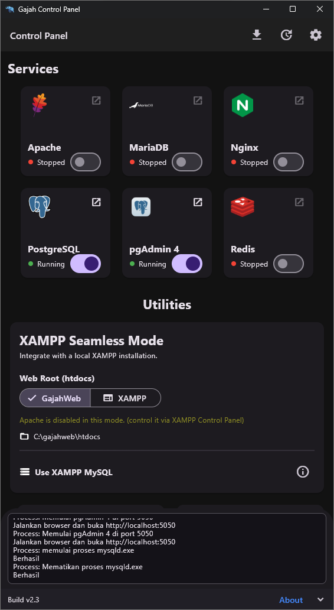

# Gajah Webserver

[](https://opensource.org/licenses/MIT) [](https://www.microsoft.com/windows) [](https://www.linux.org/)

Gajah Webserver is a desktop control panel (built with Flutter) for managing local web services and runtimes on Windows and Linux.

Latest release: [2.4](https://github.com/yohanesokta/WebServices-Gajah/releases/tag/2.4)

## Deskripsi

Gajah Webserver menyediakan satu antarmuka grafis untuk mengelola Nginx, Apache, MariaDB, PostgreSQL, Redis, dan runtime PHP secara lokal. Tujuannya adalah mempermudah pengembangan web dengan kontrol layanan, pergantian versi PHP, dan akses utilitas basis data dari satu aplikasi.

## Demo



## Fitur

- Manajemen Service Terpusat: Start/Stop/Restart untuk Nginx, Apache, MariaDB, PostgreSQL, dan Redis.
- Multi-Versi PHP: Unduh dan ganti versi PHP sesuai kebutuhan proyek.
- Monitoring Real-time: Menampilkan log output setiap service melalui terminal internal aplikasi.
- Akses Utilitas Cepat: Shortcut ke folder proyek dan alat basis data.
- Konfigurasi Mudah: Akses dan penyuntingan file konfigurasi server dan database.

## Fitur Spesifik

### Windows

- Portable: Environment berjalan dari folder `C:\gajahweb` tanpa memodifikasi registry.
- Integrasi alat basis data: HeidiSQL dan DBeaver.
- XAMPP Migration dan OTA Updates.

### Linux

- Multi-distro: Debian/Ubuntu, RHEL/CentOS, Arch, Alpine.
- System integration: Mengelola Nginx pada level sistem.
- Standar direktori: `/opt/runtime` untuk runtime dan aset.

## Instalasi & Setup

1. Clone repository:

```bash
git clone https://github.com/yohanesokta/WebServices-Gajah.git
cd WebServices-Gajah
```

2. Install dependensi Flutter:

```bash
flutter pub get
```

3. Setup environment:

- Windows: jalankan `setup.bat`.
- Linux: jalankan `sudo bash pages/linux.sh`.

4. Jalankan aplikasi:

- Windows: `flutter run -d windows`
- Linux: `flutter run -d linux`

## Menjalankan Test

- Jalankan semua test:

```bash
flutter test
```

- Jalankan test dengan coverage:

```bash
flutter test --coverage
```

## Lisensi

Dirilis di bawah Lisensi MIT.
